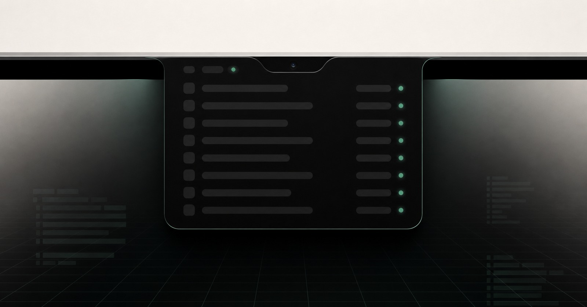
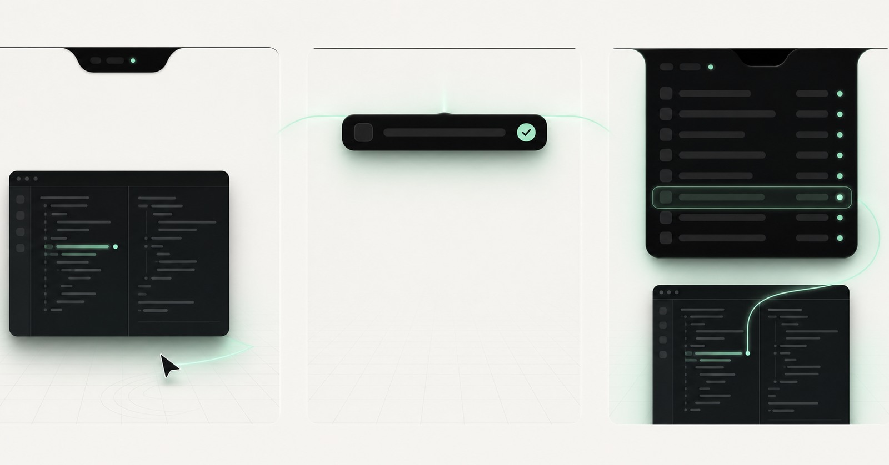
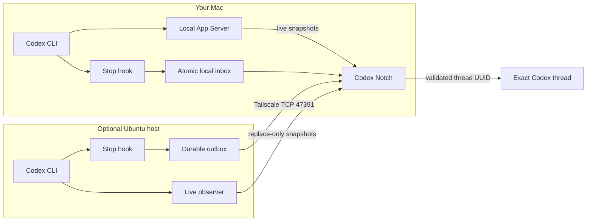

<div align="center">
  
  <h1>Codex Notch</h1>
  <p><strong>Leave the Codex window. Keep the signal.</strong></p>
  <p>A native macOS HUD for active and completed Codex work on this Mac and optional Ubuntu hosts.</p>

  <p>
    <a href="https://github.com/ralfboltshauser/codex-notch/releases/latest"></a>
    <a href="https://github.com/ralfboltshauser/codex-notch/actions/workflows/ci.yml"></a>
    
    
  </p>

  <p>
    <a href="https://github.com/ralfboltshauser/codex-notch/releases/latest"><strong>Download the signed app</strong></a>
    &nbsp;·&nbsp;
    <a href="https://codex-notch.openexp.dev/">Try the web demo</a>
    &nbsp;·&nbsp;
    <a href="https://github.com/ralfboltshauser/codex-notch/releases">Release notes</a>
  </p>
</div>



<p align="center"><sub>Product visualization based on the current macOS interface. Task content is intentionally abstracted.</sub></p>

Codex Notch is for developers who start more Codex work than they want to
watch. Start a turn, move to another window, and let the top edge of the display
carry the small amount of state that still matters: what is running, what needs
you, and what just finished.

It is not a hosted dashboard or a general notification center. The Mac app stays
local, active state comes from Codex App Server, completed turns arrive through
Codex Stop hooks, and selecting a task returns to the validated
`codex://threads/<uuid>` thread.

> **Best fit:** an Apple silicon Mac running Codex locally, with optional Codex
> work delegated to Ubuntu machines over an existing private Tailscale network.

## The three moments



<p align="center"><sub>Conceptual sequence of the real delegate, compact completion, and exact-thread handoff states.</sub></p>

| 1. Delegate | 2. Get the useful signal | 3. Return exactly |
| --- | --- | --- |
| Start a Codex turn and leave the window. Active work stays quiet. | A completed turn either opens one compact outcome or increments the numbered Glance badge, according to your attention mode. | Hover the row or open the notch, choose the task, and return to its exact Codex thread. |

The full notch remains available whenever you want the complete picture. It can
show active work, tasks waiting for approval or input, recent outcomes,
Codex account windows, paired-host health, and available app updates without
turning the menu bar into another dashboard.

## What makes it useful

- **Real runtime state.** Active tasks come from Codex App Server, not process
  names, transcript scraping, or stale terminal text.
- **One explicit attention policy.** Notify opens completions and plays the
  chosen sound, Glance keeps a numbered badge, and Quiet only collects.
- **Useful completion context.** The local Stop hook can retain one bounded,
  deterministic line from the final response; no transcript scraping or extra
  model call is involved.
- **Root-task clarity.** Project and branch identify similar work while active
  subagents roll into their parent and elevate its needs-attention state.
- **Exact-thread handoff.** Codex Notch validates the thread UUID and constructs
  the deep link itself. Remote payloads cannot provide a URL or command.
- **One view across machines.** The Mac UI can combine local Codex work with
  durable completion delivery and replace-only live snapshots from Ubuntu.
- **Honest account limits.** The header labels Codex's actual primary and
  secondary windows by duration. Seven-day history still owns the deliberately
  conservative local forecast.
- **Native control.** Global shortcuts, six themes, six completion sounds, task
  visibility, and Notify/Glance/Quiet are built into the app. macOS Focus is neither
  read nor changed.

## Install

### Requirements

- Apple silicon Mac
- macOS 13 or later
- Codex CLI on every machine that runs Codex
- Python 3 on Ubuntu, only when adding a remote host
- Tailscale and key-based SSH, only when adding a remote host

Tailscale is not required when every Codex session runs on the Mac.

### Install the signed release

1. Open the [latest GitHub Release](https://github.com/ralfboltshauser/codex-notch/releases/latest).
2. Download `CodexNotch-<version>.zip`, unzip it, and move
   `Codex Notch.app` to `/Applications` or `~/Applications`.
3. Open the app and follow the four-step onboarding.
4. Let onboarding install the bundled local Stop hook, then approve
   `Saving completion to Codex Notch` when Codex opens its hook review.
5. Hover the physical notch or the top-center screen edge, or press
   <kbd>Control</kbd>+<kbd>Shift</kbd>+<kbd>H</kbd>.

Release builds are Apple Developer ID signed, notarized, and stapled. Sparkle
verifies both Apple code signing and the release's Ed25519 signature before an
update is installed.

### Build and install from source

Building from source requires Swift 5.10 or later on macOS:

```sh
git clone https://github.com/ralfboltshauser/codex-notch.git
cd codex-notch
./scripts/install-native-macos.sh
```

This creates an ad-hoc-signed development build under
`~/Applications/Codex Notch.app` and opens the same onboarding flow.

## Add an Ubuntu host

Mac-only use is the simplest path. Add Ubuntu when Codex also runs on a home
machine, workstation, or server that already belongs to the same tailnet.

1. Confirm Tailscale is connected on both machines.
2. Add the Ubuntu machine as an SSH alias in `~/.ssh/config` and verify key-based
   SSH works from the Mac.
3. Open **Settings → Connections**, enter that alias, and choose **Pair**.
4. Codex Notch uploads the Python publisher, creates a per-host 256-bit token,
   and installs the completion retry timer and live-state user service.
5. Approve `Queueing completion for Codex Notch` when the remote Codex hook
   review opens.

The Connections page verifies the publisher, hook registration, SSH path, and
an authenticated ping back to the Mac. It also reports when a remote hook still
needs approval.

<details>
<summary>Manual Ubuntu setup for development</summary>

Normal pairing should start from the Mac app. For development, install the
publisher with pairing values created by a trusted Mac:

```sh
./scripts/install-remote-linux.sh MAC_TAILSCALE_IP 64_HEX_TOKEN HOST_LABEL HOST_ID
```

Remove it with:

```sh
./scripts/uninstall-remote-linux.sh
```

</details>

## How the state moves



### Local path

The app connects read-only to the local Codex App Server Unix WebSocket and
keeps only the latest full active-task snapshot in memory. The bundled Stop hook
writes a small JSON completion event atomically to:

```text
~/Library/Application Support/Codex Notch/inbox/
```

If the active observer disconnects, the rows show that state and then expire.
Live snapshots are not queued or replayed.

### Remote path

The Ubuntu Stop hook writes every completion to a durable outbox before trying
delivery. A systemd user timer retries queued events every 30 seconds. The queue
keeps at most 500 events and expires undelivered events after seven days.

A separate user service observes that host's App Server and sends replace-only
live snapshots. Its failure cannot block completion delivery. The Mac persists
an authenticated completion before acknowledging it, and content-derived event
IDs make retries idempotent.

See [the protocol specification](docs/protocol-v1.md) for the frame and payload
contract and [the architecture notes](docs/architecture.md) for code boundaries.

## Privacy and security boundaries

| Concern | What Codex Notch does |
| --- | --- |
| Hosted infrastructure | None. There is no Codex Notch account, hosted relay, or public port. |
| Network binding | The receiver binds only to the Mac's detected Tailscale IPv4 address on TCP port `47391`. |
| Remote authentication | Every Ubuntu host receives a separate random token stored in a user-only `0600` file. |
| Local completion record | Thread ID, turn ID, title, source identity, timestamp, and an optional bounded one-line preview of the final assistant message. It stays in the local app data. |
| Remote completion payload | Thread ID, turn ID, title, source identity, and timestamp. |
| Active snapshot | Thread, parent and root IDs; title and root title; display state and timestamp; sanitized project basename, branch, and optional agent labels. |
| Never sent from Ubuntu | Working directories, prompts, transcripts, model output, Codex credentials, URLs, and commands. |
| Account usage | Primary and secondary windows are read locally from Codex's app-server protocol. Only an exact seven-day window enters the eight-week history and forecast. |
| Existing hooks | Installation merges with `hooks.json` and creates a backup instead of replacing unrelated hooks. |

Anyone with access to an Ubuntu account can read that host's pairing token.
Tailscale access controls should still restrict which tailnet devices can reach
the Mac.

## Keyboard control

The global shortcuts below follow the Swiss German keyboard layout. Hold
<kbd>Control</kbd>+<kbd>Shift</kbd>, then press:

| Key | Action |
| --- | --- |
| `H` | Toggle the notch |
| `R` | Show or hide active tasks |
| `J`, `K`, `L`, `Ö` | Open tasks 1 to 4 |
| `U`, `I`, `O`, `P` | Open tasks 5 to 8 |
| `N`, `M` | Open tasks 9 and 10 |

The number-key shortcuts remain available. While Control and Shift are held,
Codex Notch freezes task order so a live update cannot move the target beneath
your fingers. The header shows `LOCKED` until both modifiers are released.

With the notch open, <kbd>Command</kbd>+<kbd>,</kbd> opens Settings. The shortcut
returns to the foreground app as soon as the notch closes.

## Settings that change behavior

- **Themes:** six authored palettes with live preview. The hardware-facing neck
  remains true black so it still blends into the physical display notch.
- **Sounds:** six short completion tones plus No Sound. Manual openings remain
  quiet.
- **Tasks:** active task display can be disabled without stopping the in-memory
  observer; completion outcome lines can be shown or hidden.
- **Attention:** Notify opens new completions and plays the chosen sound,
  Glance adds a numbered notch badge, and Quiet only collects. Tasks that begin
  waiting for approval or input open in Notify and Glance; update and remote
  connection signals stay glances. macOS Focus is neither read nor changed.
- **Updates:** Sparkle checks the signed feed every six hours, and Settings can
  request a check immediately.

## Develop and verify

The repository is a small monorepo:

| Path | Responsibility |
| --- | --- |
| `apps/macos` | Swift package for the native HUD, settings, stores, listeners, and bundled Stop-hook helper |
| `apps/linux` | Ubuntu completion publisher, live-state observer, and tests |
| `scripts` | Build, install, validation, release, and uninstall entry points |
| `website` | Motion-based product site and interactive web simulation |

Run the portable Linux and repository preflight on Linux or macOS:

```sh
make check-linux
```

Run the Swift suite and package an ad-hoc development app on macOS:

```sh
make test-macos
make build-macos
```

macOS CI is authoritative for AppKit type checking, Swift tests, linking, and
the packaged application. The release workflow then verifies an arm64 binary,
Developer ID signing, notarization, stapling, the signed Sparkle appcast, and
the published archive checksum.

See [the update pipeline](docs/update-pipeline.md) for release operations and
key recovery.

## Remove Codex Notch

Open **Settings → Connections** and choose **Uninstall Codex Notch…**. The app
removes and verifies its hooks, retry services, configuration, and queued events
on every paired Ubuntu host before removing the local hook, login registration,
pairing credentials, app data, and app bundle.

If a remote host is unavailable, the Mac installation is kept so cleanup can be
retried without forgetting that host.

Source installations can also run:

```sh
./scripts/uninstall-native-macos.sh
```

## Project links

- [Product site and interactive demo](https://codex-notch.openexp.dev/)
- [Latest signed release](https://github.com/ralfboltshauser/codex-notch/releases/latest)
- [Architecture](docs/architecture.md)
- [Remote protocol](docs/protocol-v1.md)
- [Update and release pipeline](docs/update-pipeline.md)
